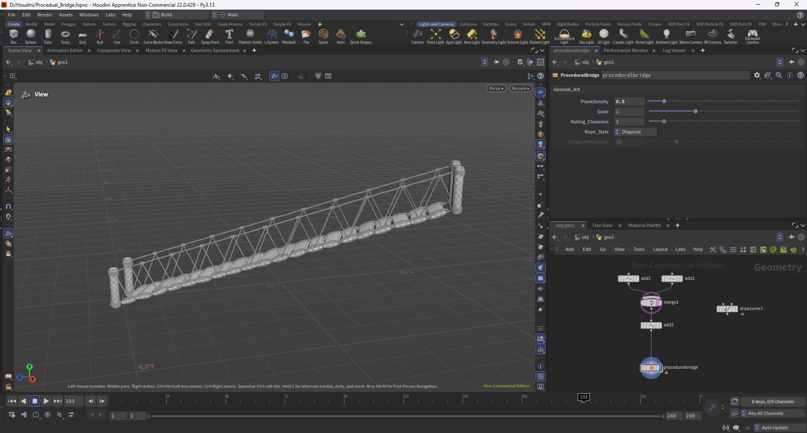
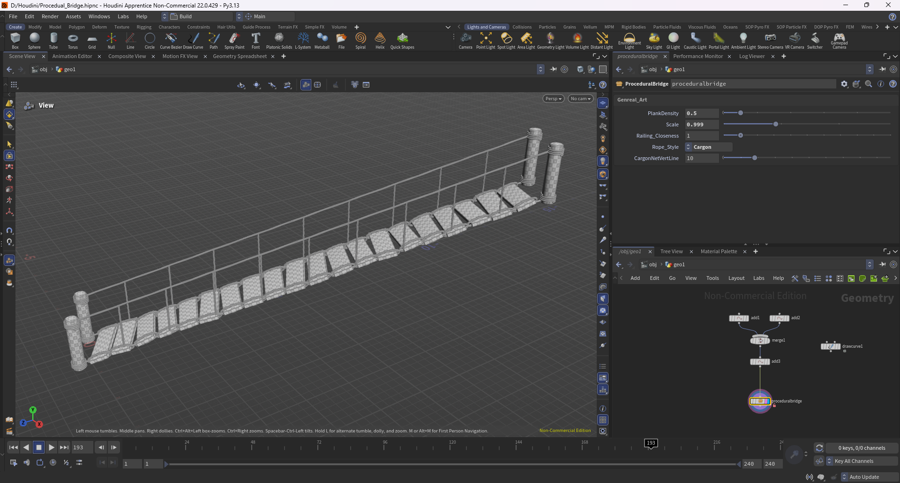
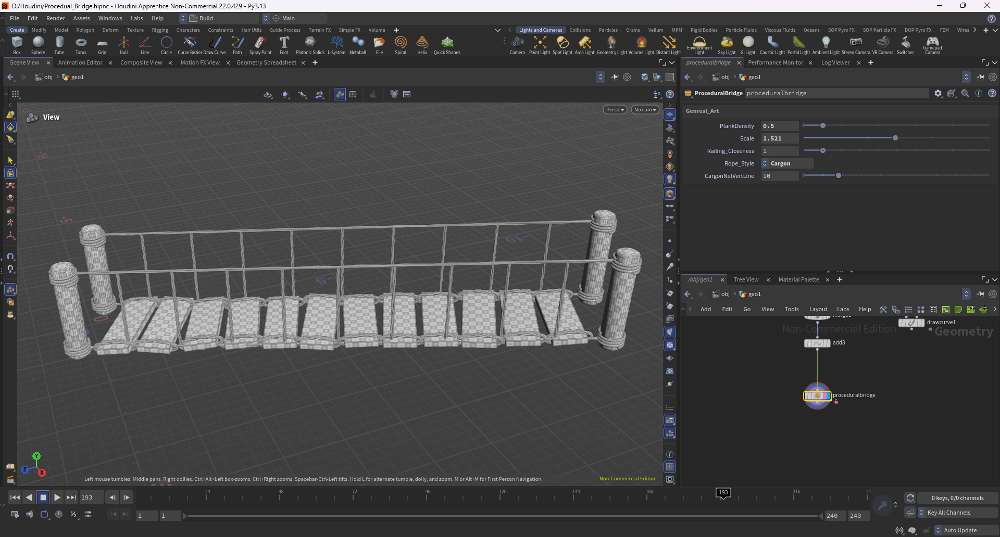
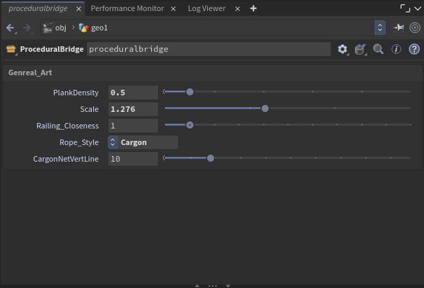

# Procedural Bridge · Houdini HDA

用**一条曲线**程序化生成整座木桥的 Houdini 数字资产（HDA），并通过 **Houdini Engine** 接入 UE5。
## 效果

| 桥梁与栏杆效果 1 | 桥梁与栏杆效果 2 |
| --- | --- |
|  |  |

**参数化：改参数即改结果**

**HDA 参数面板**（暴露给美术直接调参）

## 功能

- **曲线驱动生成**：绘制曲线定义桥梁走向 → Resample 按间距自动分段 → 沿曲线切向对齐 → 分段实例化木板铺成桥面
- **构件系统**：三类栏杆（上扶手 / 下横杆 / 侧向护网）沿曲线 Sweep 生成；桥墩立柱（圆柱生成器 + 螺旋缠绕）；绳索结构（螺旋曲线 + VEX 计算缠绕距离与类型信息后实体化）
- **程序化细节**：木板尺寸随机化 + Attribute Randomize 打破重复感；栏杆曲线用 For-Each + Connectivity 按连通块逐段处理
- **游戏资产规范化**：自动 UV 流程（AutoUV / UVLayout / UVUnwrap），输出带 UV、可直接贴图的网格
- **参数化封装**：封装为 HDA，暴露参数供美术直接调参，改参数即改结果
- **UE 集成**：通过 Houdini Engine for Unreal 导入 UE5，以 Houdini Asset Actor 在关卡中参数化生成与摆放
- **碰撞方案**：① 精细方案——UE `Collision Complexity = Use Complex Collision As Simple`，角色行走在真实三角面上；② 低面数方案——HDA 内生成独立低模碰撞层（264 三角面），以 `collision_geo` 分组交由 Houdini Engine 自动挂载

## 参数

| 参数 | 说明 |
| --- | --- |
| `Scale` | 整体缩放 |
| `PlankDensity` | 木板密度 |
| `Railing_Closeness` | 栏杆贴近程度 |
| `Rope_Style` | 绳索样式（菜单） |
| `CargonNetVertLine` | 侧网纵向分段数 |

## 文件

| 文件 | 说明 |
| --- | --- |
| `Procedual_Bridge.hipnc` | 主工程（桥梁网络 + HDA 定义） |
| `sop_proceduralbridge-1.0.hdanc` | 桥梁数字资产 |
| `Map.hipnc` | 程序化地形练习工程 |
| `sop__18414--hlp_terrian-1.0.hdanc` | 地形数字资产 |

## 环境与依赖

- **Houdini 22.0.429**（Apprentice / 非商用授权）
- 依赖 **SideFX Labs**：`labs::cylinder_generator`、`labs::autouv`、`labs::uv_transfer`、`labs::measure_curvature`、`labs::merge_small_islands`
  → 未安装 Labs 时网络中的 Labs 节点会缺失，请先安装 SideFX Labs
- UE 5.7 + Houdini Engine for Unreal

## 说明

- 工程使用 **Houdini Apprentice（非商用授权）** 制作，资产为 `.hdanc` 格式，需用非商用版 Houdini 打开
- 桥梁输出约 **18.5 万三角面**（按 hero 主景资产档位控制）
- 仓库**不包含** SideFX Labs（第三方工具包）与 Houdini 自动备份目录，见 `.gitignore`

## 作者

周尊 · 建筑学（五年制）在读 · 求职方向：技术美术 / 程序化生成
